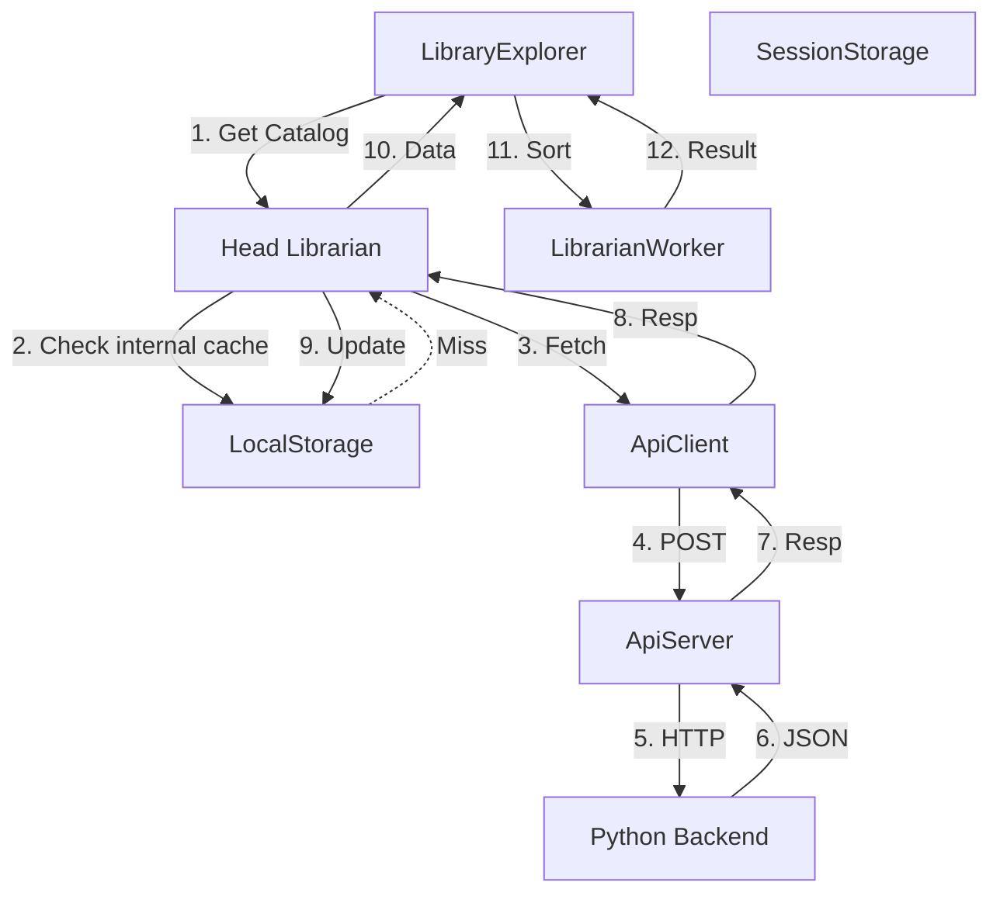

# The Library Architecture

## Overview
This document defines the architecture for the "Library" system within Data Librarian. It follows a strict **Business Layer** pattern using a "Head Librarian" metaphor to manage data fetching, caching, and state, ensuring the UI remains thin and decoupled from infrastructure.

## Core Components

1.  **Head Librarian** (`lib/head_librarian.ts`)
    *   **Role**: The Authority. The single entry point for the UI.
    *   **Responsibilities**:
        *   Manages **Card Catalog** (Cache in `localStorage`).
        *   Delegates fetching to **Jr. Librarian** (`ApiClient`).
        *   Returns standardized `ApiResponse` objects.
        *   **NEVER THROWS**. Always returns a graceful error state.

2.  **Jr. Librarian** (`lib/api_client.ts`)
    *   **Role**: The Runner.
    *   **Responsibilities**: Packaging requests, validating inputs (Client-side), and talking to the Server.

3.  **The Archives** (`lib/api_server.ts`)
    *   **Role**: The Transport.
    *   **Responsibilities**: Authenticating (future), constructing URLs, and executing network requests.

4.  **The Catalog** (`types/library.ts`)
    *   **Role**: Domain Model.
    *   **Key Type**: `CatalogCard` (Represents a file/folder).

## Data Flow Diagram



## Storage Strategy

### 1. Card Catalog (`localStorage`)
*   **Key**: `catalog_{path}`
*   **Content**: `CatalogCard[]`
*   **Purpose**: Persists heavy file lists across sessions to reduce network load.

### 2. Navigation State (`sessionStorage`)
*   **Key**: `nav_current_path`
*   **Content**: `string`
*   **Purpose**: Remembers the user's location on Page Refresh, but resets on New Tab.

## Error Handling Pattern
*   **Rule**: No `try/catch` in the Frontend UI Components.
*   **Pattern**: All layers return `ApiResponse<T>`.
    *   `api_server` catches network errors -> returns `{ success: false }`.
    *   `head_librarian` catches logic errors -> returns `{ success: false }`.
    *   `LibraryExplorer` checks `if (!res.success)` to verify state.

## Implementation Details

### Shared Types (`types/api.ts`)
```typescript
export namespace DataLibrarian {
  export interface ApiResponse<T> {
    success: boolean;
    data?: T;
    error?: string;
  }
}
```

### Domain Types (`types/library.ts`)
```typescript
export namespace DataLibrarian {
  export interface CatalogCard {
    name: string;
    path: string;
    type: "file" | "directory";
    size?: string;
    created: string;
    modified: string;
  }
}
```
